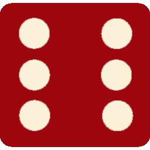

# 🎲 Dicee Game

Game sederhana untuk melempar dadu secara acak dan menentukan pemenang antara **Player 1** dan **Player 2**.



---

## 🚀 Fitur
- Melempar 2 dadu secara acak saat halaman direfresh.
- Menampilkan hasil dadu Player 1 dan Player 2.
- Menentukan pemenang:
  - **🚩 Player 1 Wins!**
  - **Player 2 Wins! 🚩**
  - **Draw!** jika angka sama.

---

## 🛠️ Teknologi yang digunakan
- **HTML5** untuk struktur halaman.  
- **CSS3** untuk styling (fonts, warna, layout).  
- **JavaScript (Vanilla JS)** untuk logika random dadu.  
- **Google Fonts**: [Lobster](https://fonts.google.com/specimen/Lobster) dan [Indie Flower](https://fonts.google.com/specimen/Indie+Flower).

---

## 📂 Struktur Project
```
Dicee/
│
├── index.html # Halaman utama
├── styles.css # Styling halaman
├── index.js # Script logic dadu
└── images/ # Folder berisi gambar dadu (dice1.png ... dice6.png)
```

---

## ▶️ Cara Menjalankan
1. Clone atau download repository ini.  
2. Pastikan folder `images/` berisi gambar:
   - `dice1.png`
   - `dice2.png`
   - `dice3.png`
   - `dice4.png`
   - `dice5.png`
   - `dice6.png`  
3. Buka file `index.html` di browser.  
4. Refresh halaman untuk melempar dadu dan pemenang akan muncul

---

## ✨ Preview
Contoh hasil:
- **Player 1: 3, Player 2: 5 → Player 2 Wins 🚩**
- **Player 1: 6, Player 2: 2 → 🚩 Player 1 Wins**
- **Player 1: 4, Player 2: 4 → Draw**

---

## 👨‍💻 Author
Edited by **Akbar Abdurrahman**  
